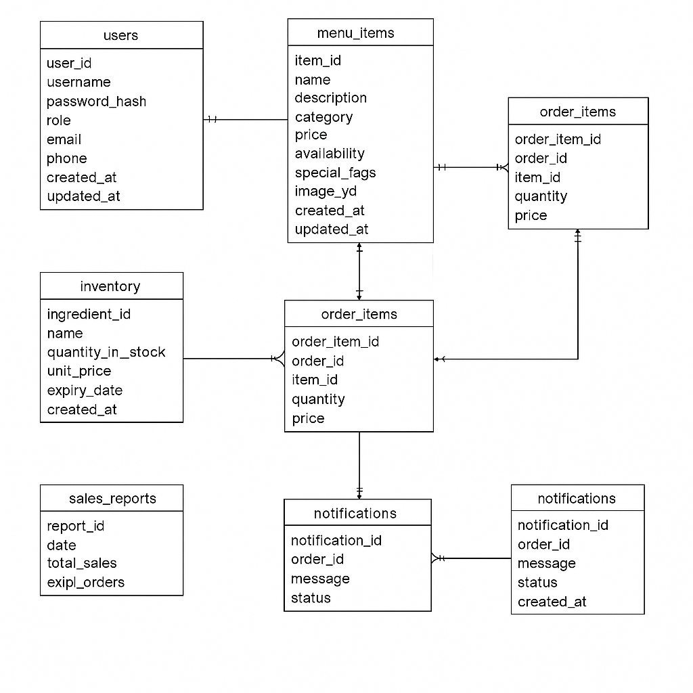

# 🍽️ Restaurant Menu and Order Management System

This document outlines the database schema and ER diagram for a comprehensive restaurant management system with role-based access control.

---

## 🛠️ Database Schema Design (Table Format)

### 👥 `users`

| Column         | Data Type                                      | Description                   |
|----------------|------------------------------------------------|-------------------------------|
| user_id        | INT PRIMARY KEY AUTO_INCREMENT                 | Unique user ID                |
| username       | VARCHAR(50) UNIQUE                             | Username                      |
| password_hash  | VARCHAR(255)                                   | Hashed password               |
| role           | ENUM('admin', 'manager', 'chef', 'waiter')     | Role of the user              |
| email          | VARCHAR(100) UNIQUE                            | Email address                 |
| phone          | VARCHAR(20)                                    | Contact number                |
| created_at     | DATETIME                                       | Account creation timestamp    |
| updated_at     | DATETIME                                       | Last update timestamp         |

---

### 🍽️ `menu_items`

| Column         | Data Type                                           | Description                     |
|----------------|-----------------------------------------------------|---------------------------------|
| item_id        | INT PRIMARY KEY AUTO_INCREMENT                      | Unique item ID                  |
| name           | VARCHAR(100)                                        | Item name                       |
| description    | TEXT                                                | Item description                |
| category       | ENUM('starters', 'main_course', 'desserts', 'beverages') | Category of item           |
| price          | DECIMAL(10,2)                                       | Price of item                   |
| availability   | BOOLEAN                                             | Is item currently available?    |
| special_tags   | VARCHAR(255)                                        | Tags like vegan, spicy, etc.    |
| image_url      | VARCHAR(255)                                        | Image path or URL               |
| created_at     | DATETIME                                            | Creation timestamp              |
| updated_at     | DATETIME                                            | Last update timestamp           |

---

### 🧾 `orders`

| Column         | Data Type                                      | Description                     |
|----------------|------------------------------------------------|---------------------------------|
| order_id       | INT PRIMARY KEY AUTO_INCREMENT                 | Unique order ID                 |
| customer_name  | VARCHAR(100)                                   | Customer name                   |
| customer_phone | VARCHAR(20)                                    | Customer phone                  |
| order_status   | ENUM('pending', 'preparing', 'ready', 'delivered') | Current status of the order |
| total_amount   | DECIMAL(10,2)                                   | Total order value               |
| created_at     | DATETIME                                       | Order creation time             |
| updated_at     | DATETIME                                       | Last status update              |

---

### 🛍️ `order_items`

| Column         | Data Type                      | Description                         |
|----------------|--------------------------------|-------------------------------------|
| order_item_id  | INT PRIMARY KEY AUTO_INCREMENT | Unique order-item mapping ID        |
| order_id       | INT                            | Reference to `orders(order_id)`     |
| item_id        | INT                            | Reference to `menu_items(item_id)`  |
| quantity       | INT                            | Quantity of the item                |
| price          | DECIMAL(10,2)                  | Price per item at time of purchase  |

---

### 📦 `inventory` (optional)

| Column           | Data Type                      | Description                     |
|------------------|--------------------------------|---------------------------------|
| ingredient_id    | INT PRIMARY KEY AUTO_INCREMENT | Unique ingredient ID            |
| name             | VARCHAR(100)                   | Ingredient name                 |
| quantity_in_stock| DECIMAL(10,2)                  | Available stock                 |
| unit_price       | DECIMAL(10,2)                  | Price per unit                  |
| expiry_date      | DATE                           | Expiry date                     |
| created_at       | DATETIME                       | Date added to inventory         |

---

### 📈 `sales_reports`

| Column            | Data Type                      | Description                               |
|-------------------|--------------------------------|-------------------------------------------|
| report_id         | INT PRIMARY KEY AUTO_INCREMENT | Unique report ID                          |
| date              | DATE                           | Report date                               |
| total_sales       | DECIMAL(10,2)                  | Total revenue                             |
| total_orders      | INT                            | Number of orders                          |
| best_selling_item | INT                            | Reference to `menu_items(item_id)`        |

---

### 🔔 `notifications`

| Column          | Data Type                      | Description                             |
|-----------------|--------------------------------|-----------------------------------------|
| notification_id | INT PRIMARY KEY AUTO_INCREMENT | Unique notification ID                  |
| order_id        | INT                            | Reference to `orders(order_id)`         |
| message         | TEXT                           | Notification message                    |
| status          | ENUM('sent', 'pending', 'delivered') | Status of notification             |
| created_at      | DATETIME                       | Notification time                       |

---

## 📊 ER Diagram


```markdown

```
